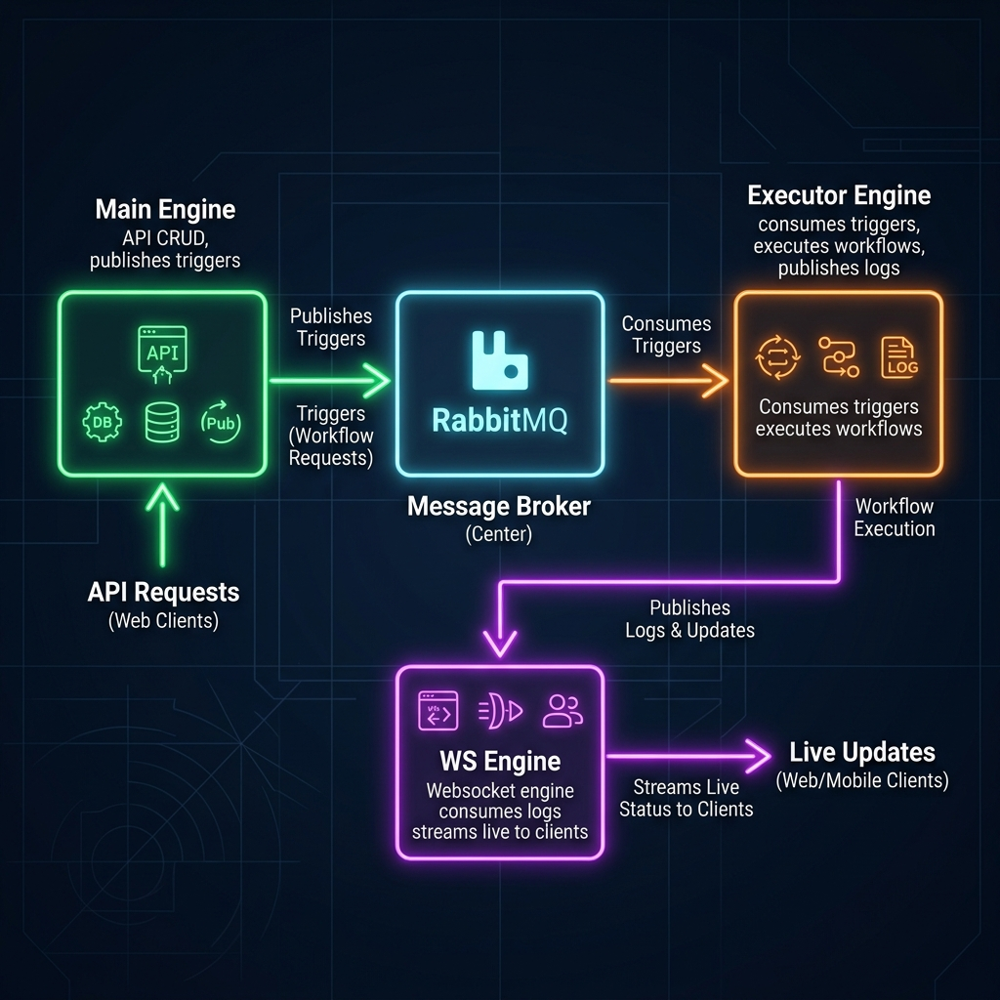
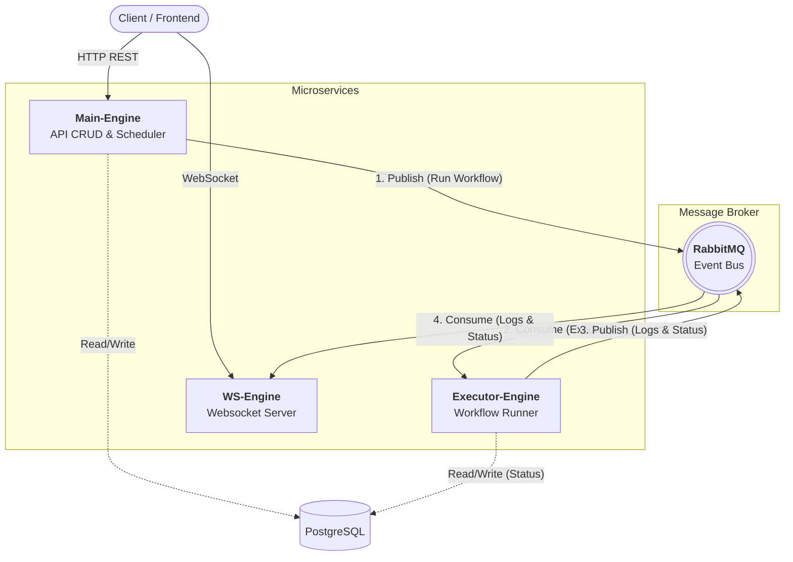

# Expected Architecture

This diagram visualizes the separation of the Workflow Engine into three distinct microservices connected via RabbitMQ.

## Component Breakdown (Mermaid)

### 1. `main-engine`
- **Role:** Handles main REST API (CRUD operations for workflows, definitions, tenants).
- **Event:** Publishes a trigger event (e.g., `workflow.trigger`) to RabbitMQ whenever a workflow needs to be executed (either by API call or CRON Scheduler).

### 2. `executor-engine`
- **Role:** The core runner. Scales horizontally to handle heavy execution loads.
- **Event:** Consumes trigger events from RabbitMQ to execute steps. While running, it publishes real-time step execution logs and state transitions (`workflow.status`, `step.log`) back to RabbitMQ.

### 3. `ws-engine`
- **Role:** Dedicated WebSocket server, decoupled from heavy lifting or APIs.
- **Event:** Consumes the logs and status updates from RabbitMQ and pushes them live to connected clients listening to specific `run_id`s or `step_id`s.
